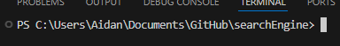
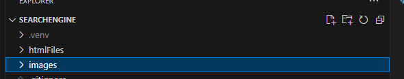
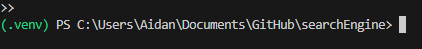
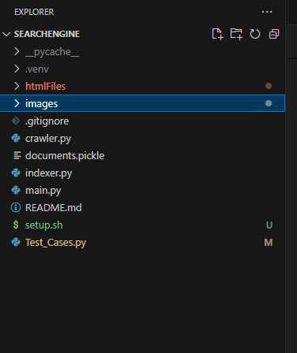
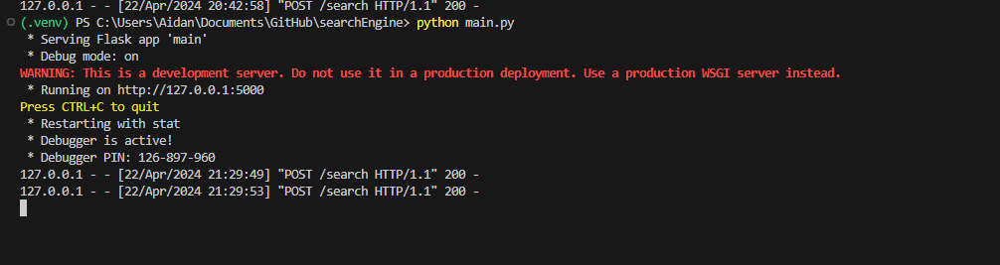
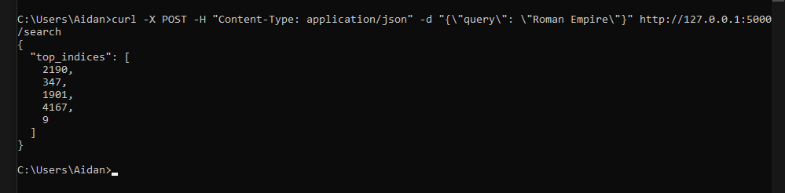
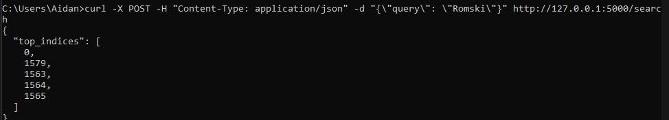
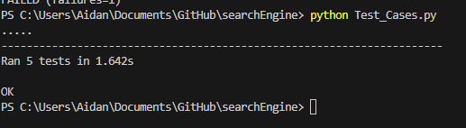

# Search Engine
## Aidan Pavlik

# Quick Summary

This project is a Fully made Search Engine from scratch. It makes use of the scrappy web crawler to scrape the internet, and then it uses the sklearn and pickle to create an inverted index using TF-IDF score/weight representation and Cosine similarity. From there we use a Flask based Processor to be able to send queries to find relevant documents. We do this by sending Post Requests while the server is running to get back the top 5 relevant documents. The next steps that I would like to take is to create a fully functional user interface so that you will be able to send queries without needing to use the terminal to send curl requests.

 # How To:

I have included a script, but I am no expert in scripts and I know they can be potentially dangerous, so I would recommend not used it if you do not need to.

## Important Notes:

I do not recommend running the crawler nor the indexer, both of them take an unreasonable amount of time to run. Furthermore, there is no reason to run them, I have provided all of the HTML files and the documents.pickle file. So there is no need to run the first 2 files.

Assuming you have Python installed on your computer already, if not it will need to be installed first along with pip.

## Setting up Virtual Environments

Note: I ran everything in VScode and everything can be run just by clicking the run button

Follow these steps in order:

 * Ensure that you are in the project directory

 * python3 -m venv .venv

 

 * .venv\Scripts\activate        (Windows)

 * .venv/bin/activate            (mac)

Image of VE active

 

 * pip install Flask

 * pip install scrapy

 * pip install scikit-learn

 * pip install beautifulsoup4

Once everything is done, your files should look like this:

## Running the Program

Note: I ran everything in VScode and everything can be run just by clicking the run button

### Running the Web Crawler (Optional)

python crawler.py

### Running the Indexer (Optional)

python indexer.py

### Running the Processor

python main.py

Here is what the webserver looks like when it is running and after 2 successful POST requests were sent to it.

### Inputting queries 

While the processor is running, open your cmd and run this command 

 * curl -X POST -H "Content-Type: application/json" -d "{\"query\": \"Roman Empire\"}" http://127.0.0.1:5000/search

You can change the query to whatever you want. Just important to note the starting file for the crawler was the Wikipedia Roman Empire article, so most of the files will at least loosely revolve around that topic.

You should get an output something similar to this:

## Original Goal:

 My original goal was to build a system capable of handling over 10,000 documents filled with a variety of different topics to really push the system and see if I was capable of building a complex Search Engine from scratch using tools I have barely ever used before. 

## Early Limitations:

I actually think my program would be capable of handling 10,000+ documents. The issue I ran into was when the indexer created the pickle file. So github has a limit of 100MB per file that is allowed to be pushed. Which means the pickle file cannot be too large.

When I first Ran the web crawler I had around 5500 documents. All of them came from Wikipedia. The first time I ran the indexer, the documents.pickle file was 230MBs, way too large for github. Later on I'll explain how the indexer was able to reduce that without reducing too many documents. 

## Web Crawler: 

The web crawler will take a starting link and it will begin scrapping at that link and will go a predefined distance before stopping. From there based on the Max pages and Max Length entered into the python file, it will go and start scraping the web and downloading HTML files using the start link as the basis. This was my first time ever using a web scraper, it may not be the best, but I feel that it is more than acceptable for the purpose of this assignment.

Some limitations of this web crawler is that it would tend to find a lot of meaningless files with nonsensical data, I'm not really sure where it was getting them from. But that would be something in the future that could be fixed. Originally, I was going to remove them, but decided against it because it would be a good test of the system if it ignores these documents or not. 

In my project:

* Starting Link: https://en.wikipedia.org/wiki/Roman_Empire

* Max Pages: 10

* Max-Depth: 3

This will get around 5500 documents. 

## Indexer: 

The indexer will take all of the provided HTML documents obtained by the web crawler and it will create the inverted index using TF-IDF score/weight representation, Cosine similarity. It does this by extracting the text from the files and parsing it. It also has a built-in system to use stop words to help make it much more efficient.

As I said earlier, I was having issues getting the documents.pickle file to be small enough to be pushable to github. The original size of the documents on my first run was 230MB. That was before I implemented stop words. After I implemented stop words, it reduced the size of the file from 230MB to 111MB, less than half. It really goes to show how many words stop words are capable of taking up. 

To remove the remaining 11MBs, I simply removed random documents. The other issue was the wikipedia documents are very long and have tons of words which also did not help. 

## Processor:

The process is a Flask Based processor that is capable of using free text queries and uses JSON to handle them. It does this by creating a local Flask webserver to run everything and then when a POST request is made with the query, it uses the index that was already created to pull out the most relevant documents. It will continue running until the user manually shuts it down. This allows the user to enter as many queries as they wish without needing to restart everything.

Future plans could be to expand the Flask Application to make a whole Web application that will allow users to enter queries directly into the program. 

## Capabilities 

For the purpose of being able to use github and not wanting the runtime to be outrageous. I was not able to test the program to its full potential. That being said, I see no reason why you could not use more than 5000 documents. I can see this program using upwards of 10-20 thousand documents without having any issues. 

Querying is also very efficient, I don’t see any reason as to why an increased pickle document would really slow down the process. 

However for what I have provided here is what it currently looks like

* Runtime of Scraper: Around 20 minutes

* Runtime of Indexer: Around 15 minutes

* Number of HTML Docs: 4704

* Size of documents.pickle: 97.2MB

## Conclusion

Overall, I can call this program a success. One way to test it easily, is by running this query

curl -X POST -H "Content-Type: application/json" -d "{\"query\": \"Romski\"}" http://127.0.0.1:5000/search

This will give an indices of: 

As you can see the first output is Doc 0 which lines up with the query I entered. 

It will also generate a total of 5 indices, the 5 that are closest to the query entered. 

One thing of caution is the exact query entered. Because I started Web Scrape in the Roman Empire. Most of the docs are related to that topic in some way. If you put in a query that has little to do with the Roman Empire, do not expect to get very good results.

Another thing to caution is that no matter what you enter, you will always get results, even if the results seem meaningless, that is most likely because the topic you have entered does not really exist in the document corpus. 

## Test Cases:

I have included 5 test cases in my program, they are 

* Test for Valid Query
* Test of missing query parameters
* Test for empty string
* Test of case insensitivity
* Test of partial Matches

All of these test cases pass, you can run these test cases for yourself by doing:

* Python Test_Cases.py

Just ensure the processor is running before doing so.

Here is what it looks like when all the test cases have passed:

## Sources/ Source Code:

*  "Scrapy." Last modified 2023. Accessed April 21, 2024. https://scrapy.org/.

*  OpenAI. "ChatGPT." Accessed April 21, 2024.

*  Python Software Foundation. "Unittest — Unit testing framework." Accessed April 21, 2024. https://docs.python.org/3/library/unittest.html.

*  Pallets Projects. "Welcome to Flask." Last modified March 15, 2023. Accessed April 21, 2024. https://flask.palletsprojects.com/en/3.0.x/.

*  "Scikit-Learn: Machine Learning in Python." Last modified 2023. Accessed April 21, 2024. https://scikit-learn.org/stable/.

*  Python Software Foundation. "Pickle — Python object serialization." Accessed April 21, 2024. https://docs.python.org/3/library/pickle.html.

*  Leonard Richardson. "Beautiful Soup Documentation." Last modified 2023. Accessed April 21, 2024. https://beautiful-soup-4.readthedocs.io/en/latest/.

